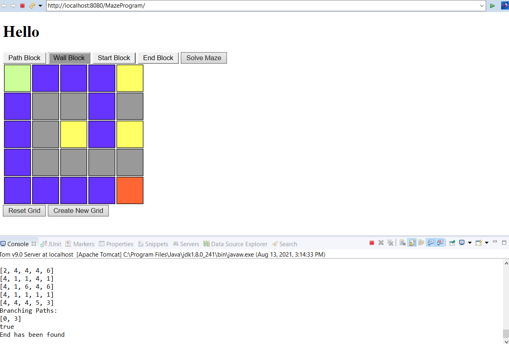
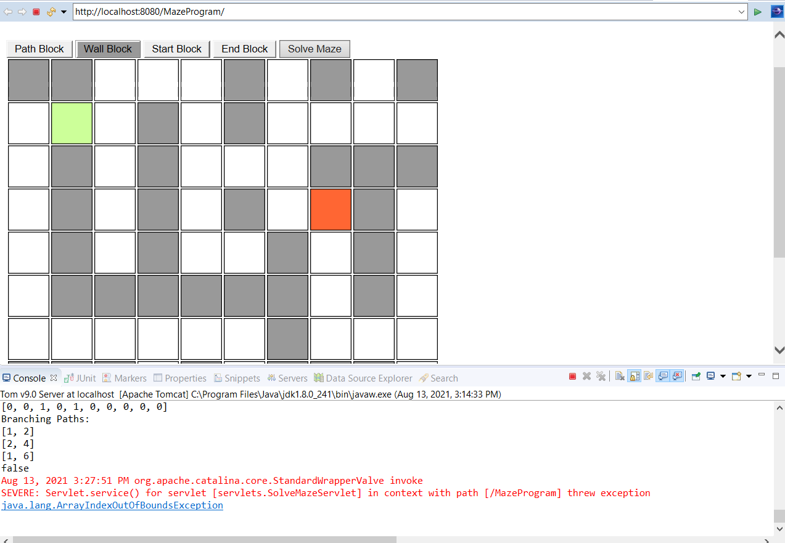

# MAZE PROGRAM

This is a small project for the sake of continuing my skills as a program developer.
The project constructs UI that will ask the user for a width and height for the maze they want to construct. It then sends that to the back-end and returns a multi-dimensional array of that size where the user can then select a start, end, wall, or path to create a maze of their choice. Once the maze is created the user then submits the maze which goes to the back end and if it is a legal maze(Meaning if the exit or start is not completely walled off from each other) then the GridSolver will go through the maze and mark paths and branches till it comes to the exit where the maze with all the marked paths will be sent back to the users front-end.

# BUGS AND THINGS TO BE AWARE OF:
There is a bug that sometimes the maze is solved but the JavaScript can't read it so it says that the maze was not solved even though the user can see that it was.
There is a chance that the GridSolver will get stuck if it branches too many times.

